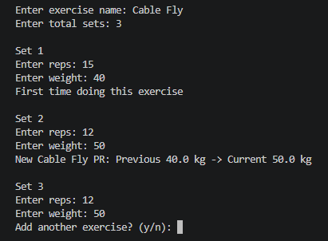
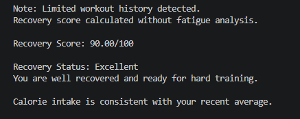
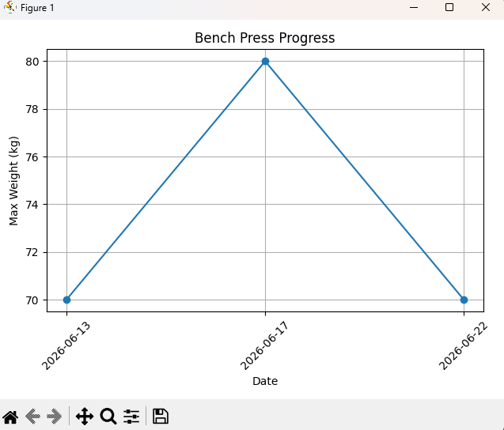

## Why I Built This

Built this project to combine my passion for fitness and programming while learning how to design data-driven applications that provide personalized workout and recovery insights.

# Fitness Tracker & Recovery Analytics

A Python-based fitness tracking application that logs workouts, analyzes performance trends, calculates recovery scores, and provides personalized workout insights based on training history.

## Features

- Workout session logging
- Daily metrics tracking (sleep, calories, bodyweight)
- Personal Record (PR) detection
- Workout volume calculation
- Progress graph visualization
- Recovery score calculation (0–100)
- Sleep score analysis
- Calorie score analysis
- Fatigue scoring based on relative training volume
- Calorie trend analysis using historical intake data
- Modular Python architecture for maintainability
- Exercise database with primary and secondary muscle mapping

## Project Structure

fitness-tracker/

│── data/                # CSV storage files  
│── project_docs/        # Learning journal and development logs  
│── screenshots/         # README screenshots  
│── src/  
│   │── main.py                  # Main application entry point  
│   │── tracker.py               # Workout logging + analytics  
│   │── recovery.py              # Recovery scoring subsystem  
│   │── helpers.py               # Utility/helper functions  
│   │── muscle_history.py        # Maps primary and secondary muscles
│   │── recommendation_engine.py    # Muscle recommendation for next workout
│── requirements.txt  
│── README.md

## Tech Stack

- Python
- Pandas
- Matplotlib
- CSV-based data storage
- Git & GitHub

## How To Run

Clone repository:

git clone https://github.com/aryansachdeva1718-web/ai-fitness-tracker.git

Install dependencies:

pip install -r requirements.txt

Run application:

python main.py

## Screenshots

### Workout Logging

### Recovery Score

### Progress Graph

## Sample Output

Recovery Score: 84/100

Status: Well Recovered

Calories are consistent with your recent average.

New Bench Press PR: Previous 75 kg → Current 80 kg

## Future Improvements

- Machine learning based workout recovery prediction
- Personalized recovery recommendations using historical training data
- Streamlit web interface for better user interaction
- Exercise recommendation engine based on progression trends
- Workout consistency and adherence analytics
- Long-term performance prediction models

